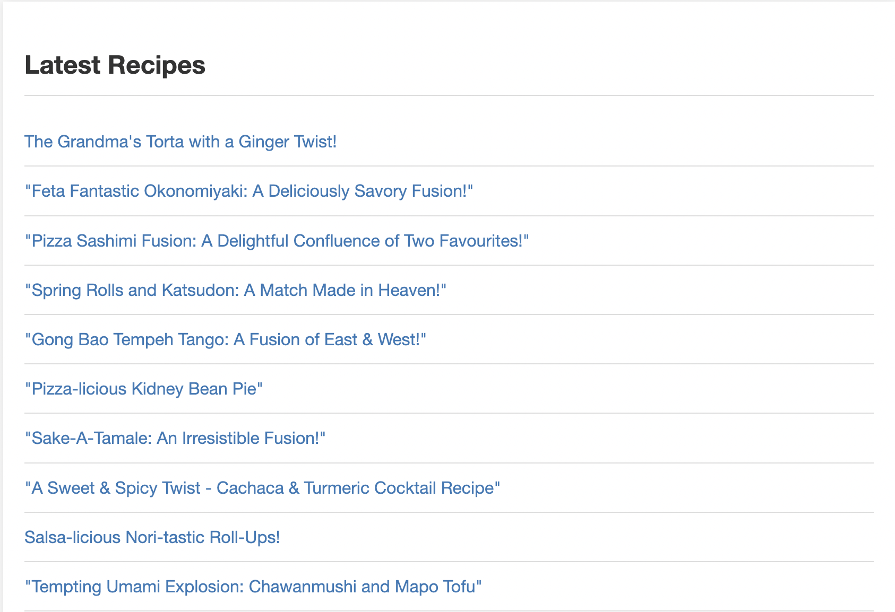

# autoHTML
## A self-updating HTMl-based blog on any topic, driven by GPT. Just add ~~water~~ an OpenAI API key.

Demo: https://gptrecipeblogger.olafblitz.repl.co/
## Setup
- Create an environmental variable called OPENAI_KEY and put in your OpenAI API key.
- Choose the topic of your blog in main.py (curate the prompts to your liking)
    - Warning: setting temperature of 0.0 will make your AI generate the same article every time.
    - Pro tip: Provide a random list of subtopics and use random.choice() to retrieve a random subtopic each time and feed that to the GPT prompt.
- Choose the article generation rate (every minute, every hour, etc.)
- Hit Run on Replit, or whatever the run command is on your IDE/setup.